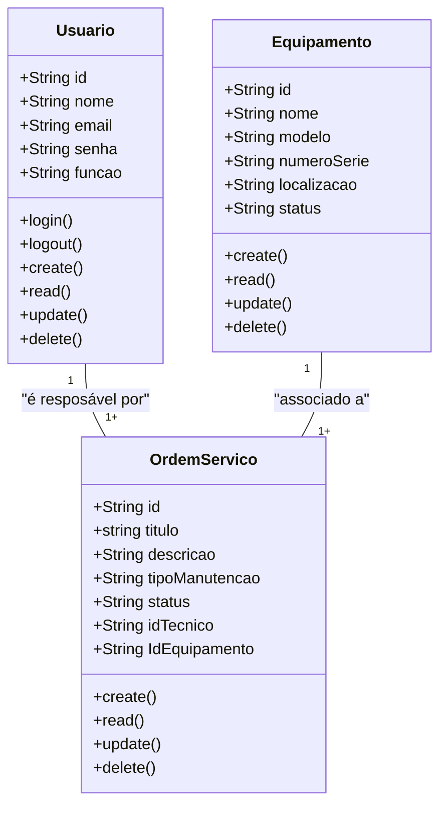
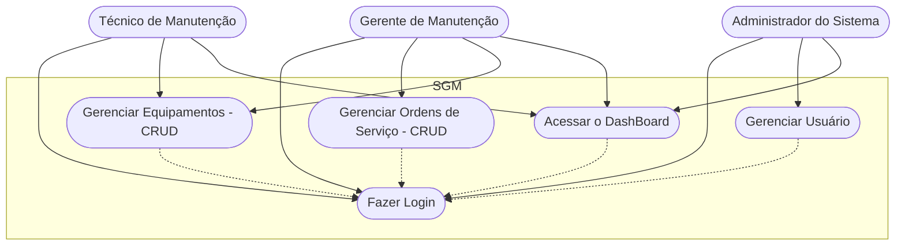
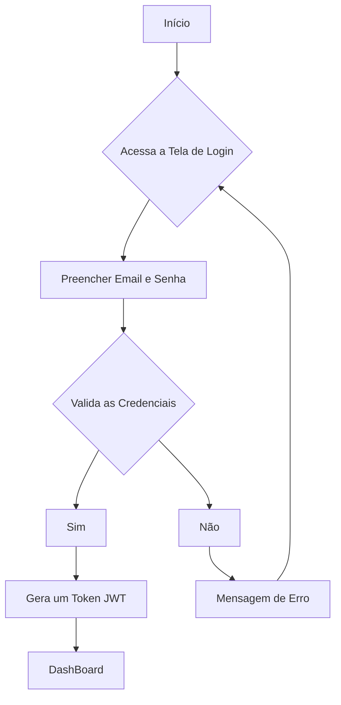

# Sistema de Gestão de Manutenção (Formativa)

## Briefing

### Visão Geral do Projeto
O projeto consiste no desenvolvimento de um Sistema de Gestão de Manutenção (SGM) no formato de uma aplicação web.

## Escopo

- ### Objetivos:

- ### Público-Alvo:
    - Técnicos de Manutenção
    - Gestores de Manutenção
    - Administradores do Sistema

- ### Recursos Tecnológicos:

## Diagramas (Mermaid, Miro, Draw.io)

1. ### Diagrama de Classes
Este Diagrama modela as principais entidades do sistema:
- Usuários (User/Usuarios);
- Máquinas/Equipamentos (Equipment);
- Ordem de Serviço(Service);

 #### Explicação do Diagrama de Classe
 - Um Usuário (Técnico) por ser responsável por várias Ordens de Servico
 - Um Equipamento por estar associado a várias Ordens de Serviço

 2. ### Diagrama de Caso de Uso
 Ilustrar as interações dos diferentes tipos de usuários (atores) com as funcionalidades do sistema

#### Explicação:
- Atores: Técnico, Gestor, Admin

- Casos de Usos:
    - Técnico: Gerenciar Ordens de Servico (CRUD) e acessar o DashBoard
    - Gestor: Gerenciar Ordens de Serviço (CRUD) , Gerenciar Equipamento (CRUD), Acessar o DashBoard
    -Admin: Gerenciar Usuário, acessar o DashBoard

    Fazer o Login -> Antes de Qualquer Ação

3. ### Diagram de Fluxo (Login e Acesso ao Dashboard)
Detalhar o passo a passo que um usuário segue para se autenticar no sistema a acessar o dashboard

#### Explicação:
- O Fluxo começa quando osuário acessa a tela de login
- Insere as credenciais( email e senha)
- O sistema verifica se as credenciais são válidas
    - se sim: gera um JWT (token) => dashboard
    - se não: mensagem de erro eusuário permanece na tela de l
    login

## Analise de Risco

# Matriz sw Anlise de Risco do Projeto SGM 

a tabela abaxiao apresneta os risoc intenficiados no projeto **SGM**,
organizados por categorias, juntocom a provabilidae, impacto e estrategias de mtitgação propostas.

---

## Riscos écnicos

Risco
Probabilidade
Impacto
Mitigação
TÉCNICOS
1. Chave secreta do JWT comprometida
Média
Alto
Utilizar chaves secretas longas e complexas, armazená-las de forma segura em variáveis de ambiente e implementar uma política de rotação de chaves.
2. Vulnerabilidade de truncamento do Bcrypt
Baixa
Alto
Garantir que a entrada para o hashing de senha nunca exceda o limite de 72 bytes, tratando a senha de forma isolada, sem concatenação com outros dados.
3. Lentidão do sistema com aumento de dados
Média
Média
Otimizar consultas ao banco de dados com indexação, implementar paginação nos resultados e planejar a arquitetura para escalabilidade futura.
4. Código de baixa qualidade com bugs
Alta
Média
Adotar práticas de código limpo, realizar revisões de código (code review) e implementar testes unitários e de integração contínua.
GERENCIAMENTO
5. Aumento do escopo (Scope Creep)
Alta
Média
Formalizar um processo de controle de mudanças. Analisar o impacto de cada nova solicitação no prazo e custo antes da aprovação.
6. Atraso na entrega do projeto
Alta
Média
Utilizar metodologias ágeis para entregas incrementais, reavaliar o cronograma a cada sprint e manter uma comunicação transparente sobre o progresso.
7. Requisitos mal interpretados
Média
Alto
Validar protótipos e wireframes com os usuários finais (técnicos e gestores) antes do desenvolvimento e manter uma comunicação constante para esclarecer dúvidas.
ORGANIZACIONAIS
8. Resistência dos usuários à nova ferramenta
Média
Alto
Envolver os usuários-chave desde o início do projeto, criar uma interface amigável (UI/UX) e comunicar claramente os benefícios do novo sistema.
9. Inserção de dados incorretos no sistema
Média
Alto
Implementar validações robustas nos formulários de cadastro e, se possível, criar um processo de importação e validação de dados existentes.
10. Falta de treinamento para os usuários
Média
Média
Desenvolver manuais de usuário, realizar sessões de treinamento práticas para cada perfil (técnico, gestor, administrador) e oferecer canais de suporte.

                   
