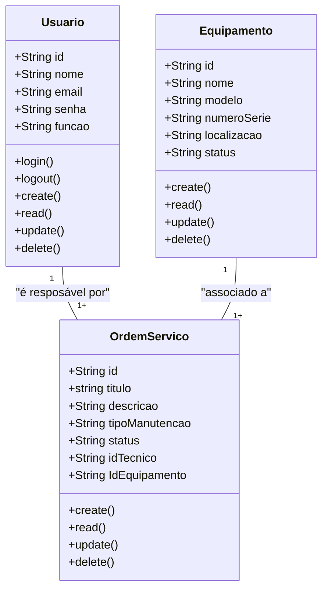

# Sistema de Gestão de Manutenção (Formativa)

## Briefing

### Visão Geral do Projeto
O projeto consiste no desenvolvimento de um Sistema de Gestão de Manutenção (SGM) no formato de uma aplicação web.

## Escopo

- ### Objetivos:

- ### Público-Alvo:
    - Técnicos de Manutenção
    - Gestores de Manutenção
    - Administradores do Sistema

- ### Recursos Tecnológicos:

## Diagramas (Mermaid, Miro, Draw.io)

1. ### Diagrama de Classes
Este Diagrama modela as principais entidades do sistema:
- Usuários (User/Usuarios);
- Máquinas/Equipamentos (Equipment);
- Ordem de Serviço(Service);


 #### Explicação do Diagrama de Classe
 - Um Usuário (Técnico) por ser responsável por várias Ordens de Servico
 - Um Equipamento por estar associado a várias Ordens de Serviço

 2. ### Diagrama de Caso de Uso
 Ilustrar as interações dos diferentes tipos de usuários (atores) com as funcionalidades do sistema

#### Explicação 

- Casos de Usos:
    - Técnico: Gerenciar Ordens de Servico (CRUD) e acessar o DashBoard
    - Gestor: Gerenciar Ordens de Serviço (CRUD) , Gerenciar Equipamento (CRUD), Acessar o DashBoard
    -Admin: Gerenciar Usuário, acessar o DashBoard

    Fazer o Login -> Antes de Qualquer Ação

```mermaid
graph TD
    subGraph "SGM"
        caso1 ([Fazer Login])
        caso2 ([Gerenciar Ordens de Serviço - CRUD])
        caso3 ([Gerenciar Equipamentos - CRUD])
        caso4 ([Gerenciar Usuário])
        caso5 ([Acessar o DashBoard])
    end

    Tecnico([Técnico de Manutenção])
    Gestor([Gerente de Manutenção])
    Admin([Administrador do Sistema])

    Tecnico --> caso1 
    Tecnico --> caso3
    Tecnico --> caso5

    Gestor --> caso1
    Gestor --> caso2
    Gestor --> caso3
    Gestor --> caso5

    Admin --> caso1
    Admin --> caso4
    Admin --> caso5

    caso2 -.-> caso1
    caso3 -.-> caso1
    caso4 -.-> caso1
    caso5 -.-> caso1

```

3. ### Diagrma de Fluxo (Login e  Acesso ao Dashboard)
Detalhar o paso a passo que um usúario segue para se 
autenticar no sistea a acessar o dashboard

#### Explicação:

- O Fluxo comça quando o usuario acessa a tela de logi 
- Insere as credenciasi(email e senha)
- O sistema veerifica se as credencasi são válidas 
   - se sim; gera um JWT (token ) = dasboard
   - se não: mensagem de erro eusario permance na tela de login


```mermaid

graph TD
 A[Início] --> B{Acessa a Tela de Login}
 B --> B[Preeencher Email e Sneha ]
 C --> C{Validar as Credenciais}
 D --> Sim --> E[Gera um token JWt]
 E - F [DshBoard]
 D --> Não --> K [Mensagem de erro]
 k --> B