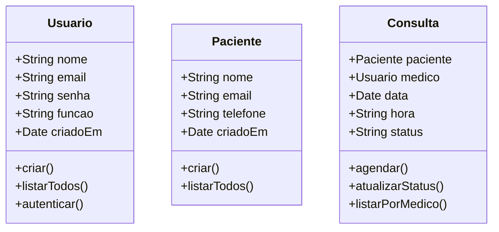

# Sistema de Agendamento Médico

## Descrição do Projeto
Este projeto é um sistema de **agendamento médico** que permite que recepcionistas e administradores gerenciem consultas, médicos e pacientes.  
O sistema foi desenvolvido com **Next.js** e **MongoDB**, e possui controle de usuários (admin, recepcionista, médico e paciente).  

Funcionalidades principais:
- Cadastro de usuários e pacientes
- Agendamento, remarcação e cancelamento de consultas
- Listagem de consultas por médico ou paciente
- Autenticação de usuários com permissões diferenciadas

---

## Requisitos Funcionais

1. **Usuários**
   - O sistema deve permitir criar usuários com função:  `recepcionista`, `medico`, `paciente`.
   - Usuários recepcionistas podem agendar e gerenciar consultas.
   - Médicos podem visualizar suas consultas.
   - Pacientes podem visualizar apenas suas consultas.

2. **Pacientes**
   - Cadastro de pacientes com nome, email e telefone.
   - Atualização de dados do paciente.
   - Listagem de pacientes disponíveis para agendamento.

3. **Consultas**
   - Agendar consultas informando paciente, médico, data e hora.
   - Remarcar ou cancelar consultas existentes.
   - Atualizar status da consulta: `Agendada`, `Confirmada`, `Realizada`, `Cancelada`.
   - Listar consultas por médico ou por paciente.

---

## Requisitos Não Funcionais

- Sistema web responsivo.
- Uso de MongoDB para persistência de dados.
- Validação de dados no backend.
- Logs de operações para auditoria.
- Segurança básica: autenticação de usuários.
- Performance adequada para até 1000 consultas simultâneas.

---

## Diagrama de Classes (Mermaid)




```graph TD
    A[Recepcionista] --> B[Seleciona paciente]
    B --> C[Seleciona médico]
    C --> D[Escolhe data e hora]
    D --> E[Confirma agendamento]
    E --> F[Consulta criada no banco]
    F --> G[Médico recebe notificação]
    F --> H[Paciente pode visualizar sua consulta]
```


## Estrutura


/app
  /api
    /usuarios
      route.ts
    /pacientes
      route.ts
    /consultas
      route.ts
/models
  Usuario.ts
  Paciente.ts
  Consulta.ts
/controllers
  UsuarioController.ts
  PacienteController.ts
  ConsultaController.ts
/services
  connectMongo.ts


## Tecnologias Utilizadas

Next.js (API routes / App Router)

MongoDB (Mongoose)

TypeScript

Mermaid.js para diagramas

Node.js / Express (caso precise para serviços)

## Figma

https://www.figma.com/design/qvtFlhEOlTqUVGyjYtk8yv/Sem-t%C3%ADtulo?node-id=5-199&t=HMZ69pGXl4wTcbOq-1